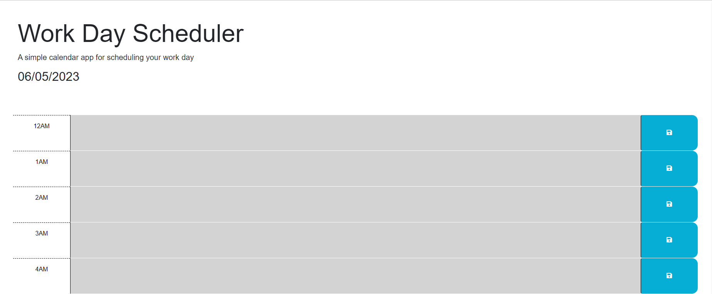
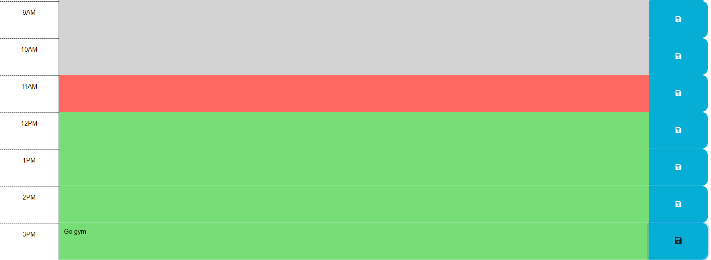

# <Workday Planner>

## Description

I started this project to further my proficiency with 3rd party web API's, such as JQuery and Day.JS. With the help of some starter code, 
I created a workday planner. This application allows users to schedule their day by the hour. After completing this project, I feel much more 
confident working with web API's and with JavaScript in general.

## Installation

To install and run this application, just pull the code from the repository, open the code in an IDE, and run it in your browser of choice.

## Usage

In order to use this application, all you have to do is type what you have planned for the day in each time block. From there,
click the save button to save what you typed. Each time block will change color depending on if it is in the past, present, or future. 
Easy peasy lemon squeezy.

## Credits

I would like to say thank you to my tutor Andres Long. He helped me with pulling the data that gets saved to local storage back to the planner page.
Also shoutout to AskBCS. It is a very helpful resource for when I get stuck. Good people over there.

## License

MIT License

Copyright (c) [2023] [Benjamin Whann]

Permission is hereby granted, free of charge, to any person obtaining a copy
of this software and associated documentation files (the "Software"), to deal
in the Software without restriction, including without limitation the rights
to use, copy, modify, merge, publish, distribute, sublicense, and/or sell
copies of the Software, and to permit persons to whom the Software is
furnished to do so, subject to the following conditions:

The above copyright notice and this permission notice shall be included in all
copies or substantial portions of the Software.

THE SOFTWARE IS PROVIDED "AS IS", WITHOUT WARRANTY OF ANY KIND, EXPRESS OR
IMPLIED, INCLUDING BUT NOT LIMITED TO THE WARRANTIES OF MERCHANTABILITY,
FITNESS FOR A PARTICULAR PURPOSE AND NONINFRINGEMENT. IN NO EVENT SHALL THE
AUTHORS OR COPYRIGHT HOLDERS BE LIABLE FOR ANY CLAIM, DAMAGES OR OTHER
LIABILITY, WHETHER IN AN ACTION OF CONTRACT, TORT OR OTHERWISE, ARISING FROM,
OUT OF OR IN CONNECTION WITH THE SOFTWARE OR THE USE OR OTHER DEALINGS IN THE
SOFTWARE.
